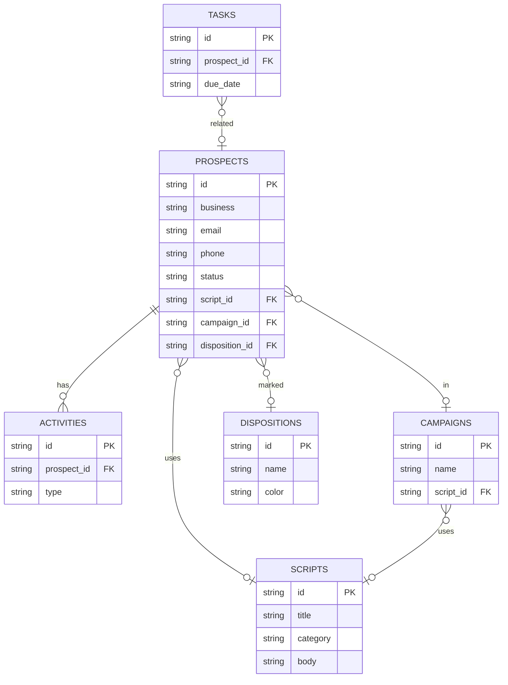

# ER Diagram

```mermaid
erDiagram
  PROSPECTS ||--o{ ACTIVITIES : has
  PROSPECTS }o--o| SCRIPTS : uses
  PROSPECTS }o--o| CAMPAIGNS : in
  PROSPECTS }o--o| DISPOSITIONS : marked
  TASKS }o--o| PROSPECTS : related
  CAMPAIGNS }o--o| SCRIPTS : uses

  PROSPECTS {
    string id PK
    string business
    string email
    string phone
    string status
    string script_id FK
    string campaign_id FK
    string disposition_id FK
  }
  SCRIPTS {
    string id PK
    string title
    string category
    string body
  }
  CAMPAIGNS {
    string id PK
    string name
    string script_id FK
  }
  DISPOSITIONS {
    string id PK
    string name
    string color
  }
  ACTIVITIES {
    string id PK
    string prospect_id FK
    string type
  }
  TASKS {
    string id PK
    string prospect_id FK
    string due_date
  }
```
